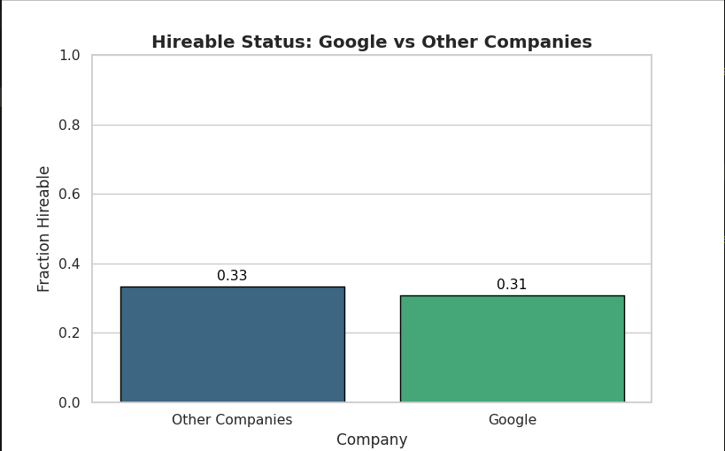
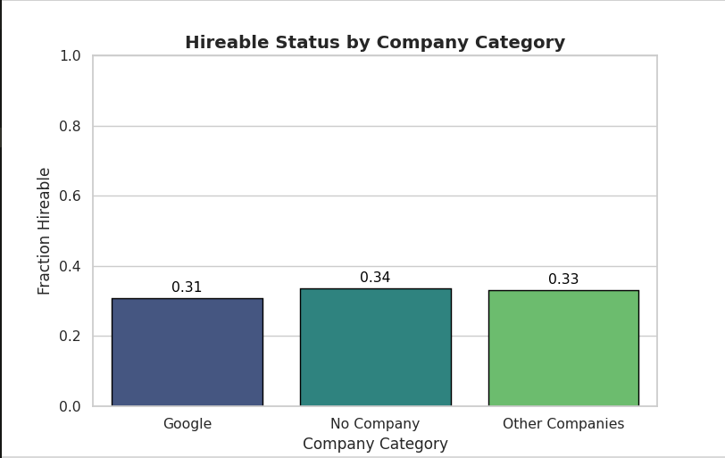
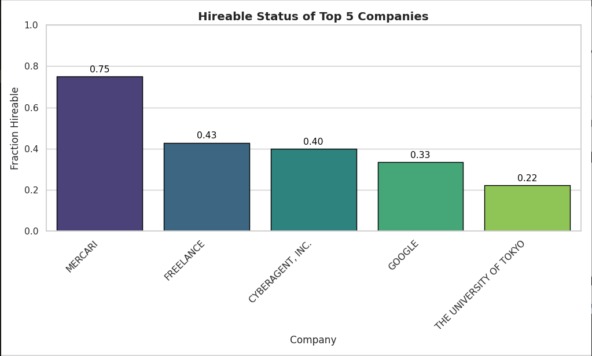
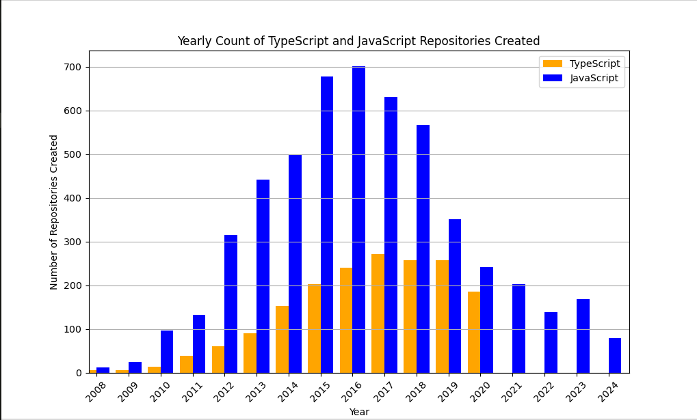
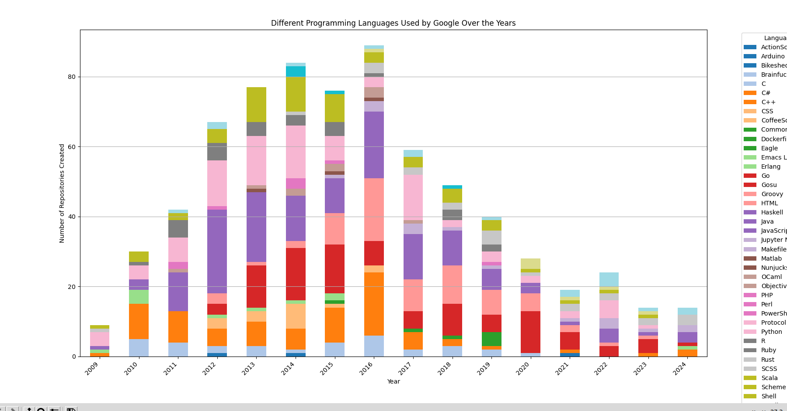
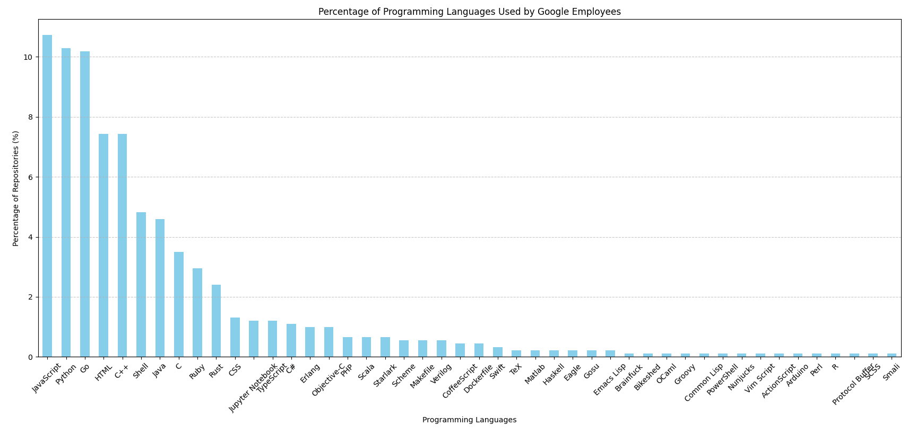

# Project_1

---

This is my submission for Project-1 of TDS

## Review Points

- The data was scraped using the **GITHUB REST API**, using my personal **ACCESS TOKENS**. _Python_'s **requests** and **csv** library was used automate the process. Cleaning was done in Python as well as using a sed script.

- Although **Google** is considered one of the dream companies to work at, The fraction of google employees marking themselves as hireable is same as both the fraction from other companies and people with no companies listed.
- Most **Google** Developers in Tokyo have made repositories on _JavaScript_,_Python_,_GO_,_HTML_,_C++_, So developers interested in working in **Google** can try to improve their skills in these languages.

## Charts for Reference

_All the charts can be generated using <a href="https://github.com/Shiva9361/Project1/blob/main/inference.py">inference</a>_

---

---

---

---

---

---

